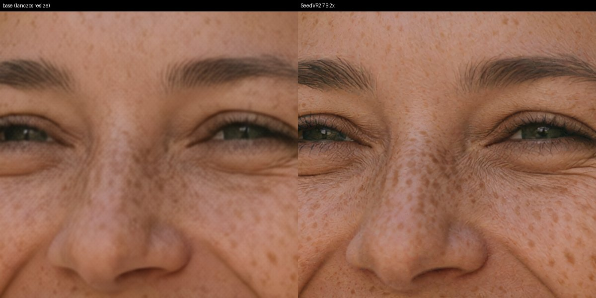
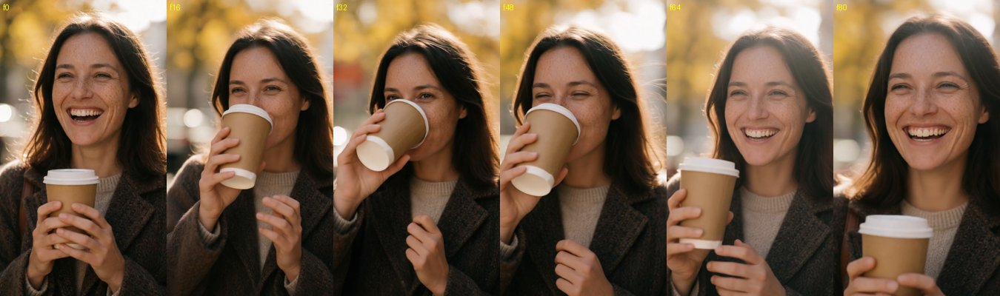
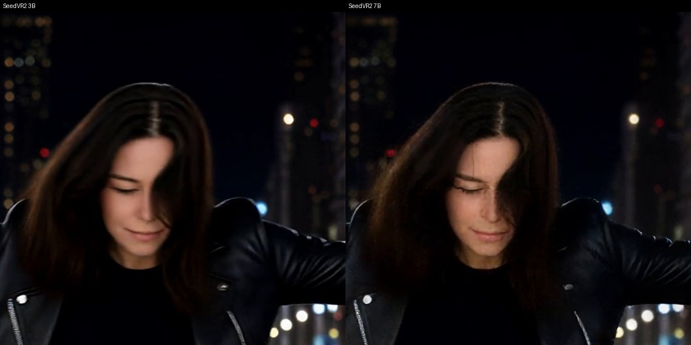
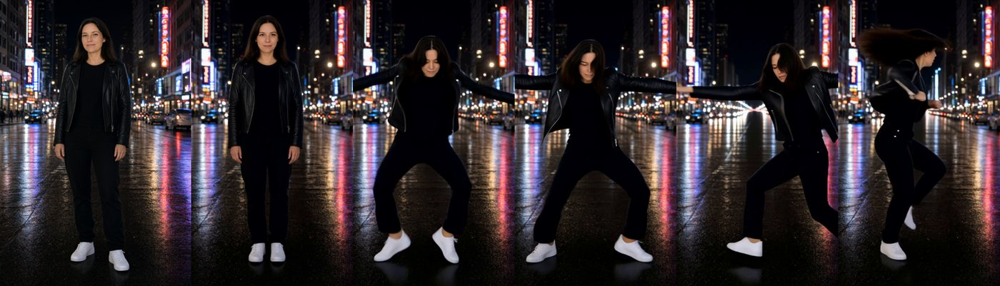
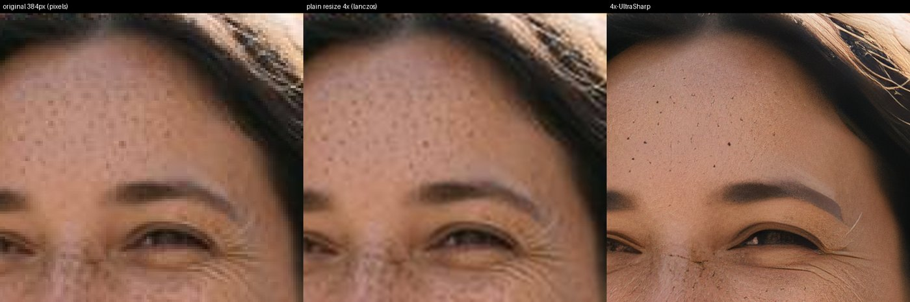
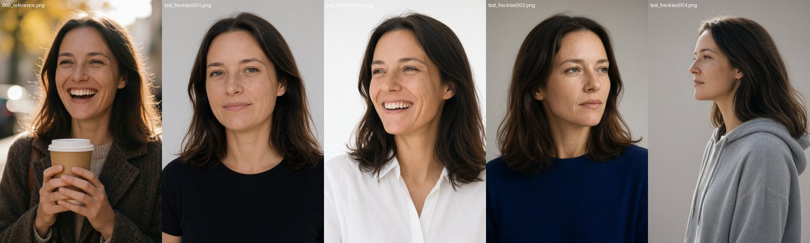

# sns-comfy-ui-workflows

ComfyUI workflows for photorealistic images, consistent characters, image-to-video with sound, motion transfer and upscaling, using current open models (October 2026).

- **100% local.** No API keys, no paid services and no Hugging Face login: every model downloads anonymously.
- **Free to run, not always free to sell.** 03d, 03e, 04 and 05 are fine for commercial work. 01 and 03a–c have revenue limits. 02, 06 and 07 are non-commercial. See [Licenses](#licenses).
- **Tested end to end** on an RTX 5090 (32 GB VRAM, 128 GB RAM) with ComfyUI v0.38. Speeds below are from that machine.

<p align="center"><br><sub>🤖 AI-generated image · workflow 01, Krea 2 · not a real person</sub></p>

---

## Workflows

| # | Workflow | What it does | Main models | Time* |
|---|---|---|---|---|
| 01 | [`01_T2I_Krea2_FaceHand_SeedVR2`](workflows/01_T2I_Krea2_FaceHand_SeedVR2.json) | Text → photoreal image. Fixes small faces and hands, then a 2× detail upscale | Krea 2 Turbo, SeedVR2 7B | ~27 s for 8 MP |
| 02 | [`02_T2I_Typography_Qwen21`](workflows/02_T2I_Typography_Qwen21.json) | Text → image with correctly spelled text (posters, signs, layouts) | Qwen-Image 2.1 | ~30 s |
| 03a | [`03a_I2V_LTX23_with_audio`](workflows/03a_I2V_LTX23_with_audio.json) | Image + prompt → video **with generated sound** | LTX-2.3 22B | ~65 s / 5 s clip |
| 03b | [`03b_T2V_LTX23_with_audio`](workflows/03b_T2V_LTX23_with_audio.json) | Text → video with sound | LTX-2.3 22B | ~75 s / 5 s clip |
| 03c | [`03c_LipSync_Image+Audio_LTX23`](workflows/03c_LipSync_Image+Audio_LTX23.json) | Portrait + audio file → talking/singing video | LTX-2.3 22B | ~85 s / 8 s clip |
| 03d | [`03d_I2V_Wan22_best_motion`](workflows/03d_I2V_Wan22_best_motion.json) | Image + prompt → video with the most realistic motion (no sound) | Wan 2.2 14B | 85 s fast mode / ~12 min full (720p) |
| 03e | [`03e_FirstLastFrame_Wan22`](workflows/03e_FirstLastFrame_Wan22.json) | Video that travels from a first frame to a last frame | Wan 2.2 14B | ~1.5 min fast mode / ~12 min full (720p) |
| 04 | [`04_Video_Finisher_SeedVR2_RIFE`](workflows/04_Video_Finisher_SeedVR2_RIFE.json) | Any video → 2× resolution and 2× frame rate, audio kept | SeedVR2 7B, RIFE 4.26 | ~4 min / 3.4 s clip |
| 05 | [`05_MotionTransfer_WanAnimate2`](workflows/05_MotionTransfer_WanAnimate2.json) | Your recorded movement → performed by any character image | Wan Animate 2 | ~65 s / 3.4 s clip |
| 06 | [`06_Character_MultiRef_Edit_Qwen21`](workflows/06_Character_MultiRef_Edit_Qwen21.json) | Same person in new scenes, outfits, poses (up to 10 reference images) | Qwen-Image 2.1 | ~20 s |
| 07 | [`07_Upscale_4xUltraSharp`](workflows/07_Upscale_4xUltraSharp.json) | Quick 4× image upscale: upload, run, saved | 4x-UltraSharp | 1–3 s |

\*RTX 5090. Expect roughly 1.5–2× longer on a 4090. Very large models are partly offloaded to system RAM automatically.

---

## Setup

### 1. ComfyUI
- **ComfyUI v0.38 or newer**: the [Desktop app](https://www.comfy.org/download) or a [manual install](https://github.com/Comfy-Org/ComfyUI).
- Older versions don't have the Krea 2, Qwen-Image 2.1, Wan Animate 2 or native SeedVR2 nodes.

### 2. Custom nodes (only for workflow 01)
Everything else uses built-in ComfyUI nodes. Install these with **ComfyUI-Manager** (*Custom Nodes Manager*), then restart:
- [ComfyUI-Impact-Pack](https://github.com/ltdrdata/ComfyUI-Impact-Pack): face/hand detailer
- [ComfyUI-Impact-Subpack](https://github.com/ltdrdata/ComfyUI-Impact-Subpack): YOLO detectors

### 3. Models
Two ways to get them:

**a) Automatic, from inside ComfyUI.** Open a workflow. The **Missing Models** panel lists anything you don't have, and each entry includes its download link.

**b) Download script.** Pure Python, resumable, needs no login:
```bash
# everything (29 files, ~204 GB)
python scripts/download_models.py --models-dir "C:/path/to/ComfyUI/models"

# or only the workflows you want
python scripts/download_models.py --models-dir "C:/path/to/ComfyUI/models" --workflows 01 07

# preview the list / check that every link works
python scripts/download_models.py --list
python scripts/download_models.py --check
```

| Workflow | Download size |
|---|---|
| 01 | ~53 GB |
| 02 | ~42 GB |
| 03a–c | ~42 GB (shared) |
| 03d–e | ~38 GB |
| 04 | ~17 GB (shared with 01) |
| 05 | ~26 GB |
| 06 | ~42 GB (mostly shared with 02) |
| 07 | 67 MB |

> **Impact Subpack note:** the face/hand detector files must sit in `ComfyUI/models/ultralytics/bbox/` of your **main** ComfyUI models folder. The plugin doesn't look in extra model folders.

### 4. Load the workflows
Drag a `.json` file from `workflows/` onto the ComfyUI canvas. To have them all in the sidebar instead, copy them into `ComfyUI/user/default/workflows/`.

### 5. Optional: speed
[SageAttention](https://github.com/woct0rdho/SageAttention) made attention **4.8× faster** in our test on the 5090. That matters most for video (Wan / LTX). Install the wheel matching your PyTorch + CUDA, then launch ComfyUI with `--use-sage-attention`.

> Close games and other GPU-heavy apps while generating. A running game holding ~15 GB of VRAM made generation 50–100× slower in our tests.

---

## How to use each workflow

### 01 · Text → photoreal image (Krea 2)
1. Type your prompt in the green **PROMPT** box. Describe hands when they matter ("hands wrapped around the cup").
2. **Enhance prompt?** Turn it on to let an LLM expand a short idea into a detailed prompt.
3. Press **Run**. You get two outputs: `T2I_detailed` (2 MP) and `T2I_upscaled` (8 MP).

How it works:
- **Base image:** Krea 2 Turbo renders at 2 MP, 8 steps.
- **Small faces and hands:** only faces narrower than ~270 px and hands narrower than ~315 px (at 2 MP) are re-rendered, up to 10 faces and 6 hands.
- **Why only small ones:** in testing, re-rendering *large* faces made skin worse, because Krea 2 already renders them perfectly. Small faces in crowds and wide shots are where it helps.
- **Upscale:** SeedVR2 7B does a 2× upscale that adds real skin, hair and eyelash detail.

<p><br><sub>🤖 AI-generated image · workflow 01, Krea 2 + SeedVR2 upscale · not a real person</sub></p>

Options:
- **Skip the upscale:** right-click the orange group → *Bypass Group Nodes*.
- **Use your own character LoRA:** select it in *Character LoRA*, press **Ctrl+B** to enable it, and put the trigger word in the prompt.
- **License:** Krea 2 requires you to add your own content filter (e.g. an NSFW classifier) wherever you deploy it. The workflow doesn't include one. See [LICENSING.md](LICENSING.md#workflow-01-krea-2-text-to-image-facehand-fix-upscale).

### 02 · Typography (Qwen-Image 2.1)
Put the exact words in quotes, e.g. `vintage poster, headline "ZAKOPANE", subtitle "Winter 1936"`. The built-in prompt enhancer plans the layout for you.

<p><br><sub>🤖 AI-generated image · workflow 02, Qwen-Image 2.1 · not a real person</sub></p>

### 03a / 03b · Video with sound (LTX-2.3)
- **03a:** load an image, then describe **what happens**, not what the scene looks like (the image already shows that). Example: "she laughs, sips the coffee and smiles at someone off-camera, city street ambience".
- **03b:** text only.
- Both generate matching audio: ambience, effects, voices.
- The LTX license requires published videos to be labelled as AI-generated.
- The prompt enhancer runs on plain Gemma 3. The Comfy template's "abliterated" (uncensored) Gemma LoRA is included but bypassed, because it conflicts with Gemma's use policy ([details](LICENSING.md#workflows-03a-03b-03c-ltx-23-video-with-sound-lip-sync)).

### 03c · Lip-sync (LTX-2.3)
Load a portrait and an audio file (speech or singing), then describe the person talking.
- **Only use people who have agreed to it.** The LTX license bans deepfakes made without consent.
- **Use a neutral, closed-mouth portrait.** A laughing photo freezes the mouth.
- **Known limitation:** the lips follow the audio well at first but often settle into a smile after a few seconds. It's fine for short lines; for long talking-head content, a dedicated lip-sync model works better.

### 03d · Image → video, best motion (Wan 2.2)
Load an image and describe the motion and camera move.
- **Preview first:** turn on **"Enable 4steps LoRA"** for fast previews (~85 s at 720p).
- **Final render:** turn it off for full quality (~12 min). In our test both looked very close.
- Wan outputs 16 fps; run the result through **04** for 32 fps.

<p><br><sub>🤖 AI-generated video frames · workflow 03d, Wan 2.2 · not a real person</sub></p>

### 03e · First + last frame (Wan 2.2)
1. Load a **FIRST FRAME** and a **LAST FRAME** of **the same scene**, e.g. two poses of one person.
2. Describe what happens between them, and set the size to match your images (1280×720 or 720×1280).
3. **FAST MODE?** switches between Lightning 4-step (~1.5 min) and full 20-step quality (~12 min). One switch changes the model, steps, cfg and expert split together.

If the two frames differ in outfit or background, the clip will jump abruptly between them. Extreme jumps, like a painting to a photo, produce a blurry morph halfway.

### 04 · Video finisher
1. Load any clip.
2. SeedVR2 7B upscales it 2×. The clip is processed in VRAM-sized chunks, so long videos work.
3. RIFE doubles the frame rate; the fps is set automatically.
4. The audio track is kept.

<p><br><sub>🤖 AI-generated video frame · workflow 04, SeedVR2 3B vs 7B · not a real person</sub></p>

To trade quality for speed, switch the model to `seedvr2_3b_fp16` (about the same speed in our test, visibly softer), or bypass the upscale group to interpolate only.

### 05 · Motion transfer (Wan Animate 2)
1. Record yourself on a phone (dance, gestures, walking).
2. Load the video and a character image. **Match the framing**: use a full-body character for full-body video, head-and-shoulders for talking.
3. The character performs your exact movement.

Use footage and character images of people who have agreed to it, and label the results as AI-generated.

<p><br><sub>🤖 AI-generated video frames · workflow 05, Wan Animate 2 · not a real person</sub></p>

### 06 · Same character, new scenes (Qwen-Image 2.1)
Load 1–10 reference images of the person and describe the new shot ("same woman, red dress, beach at sunset").

### 07 · Quick upscale (4x-UltraSharp)
1. Upload a low-res image. The upload node shows the original.
2. Press **Run**.
3. The upscaled image appears in **RESULT + SAVE** and is saved to `output/upscale/`.

Controls:
- **Naturalness** (default 0.25) blends a little of a plain resize back in. 4x-UltraSharp alone makes skin look smooth and painted; set 0 for text, logos and illustrations.
- **Final size:** 1.0 = 4×, 0.5 = 2×.

<p><br><sub>🤖 AI-generated portrait, right panel upscaled with 4x-UltraSharp · workflow 07 · not a real person</sub></p>

---

## Consistent character: the full pipeline

The most reliable way to keep one identity across hundreds of images and videos.

> **Non-commercial as built.** Step 2 uses Qwen-Image 2.1, which is licensed for research and evaluation only. For a commercial character, build the dataset with Qwen-Image-Edit-2511 (Apache-2.0) instead. If you share a trained LoRA, its name must start with "Krea" and it needs a Notice file ([details](LICENSING.md#character-lora-pipeline)). Use only a person who has consented, or an invented one.

1. **Design.** Make one strong portrait with **01**: front-facing, neutral expression, plain background.
2. **Dataset.** Turn it into ~30 identity-locked variations (angles, expressions, outfits, lighting, framing), with captions:
   ```bash
   python scripts/make_character_dataset.py --ref hero.png --name ava --trigger "ohwx woman" --server http://127.0.0.1:8000
   ```
   ComfyUI must be running. Use port `8000` for the Desktop app, `8188` for a manual install. Then **curate**: delete any image where the face drifted.

   <p><br><sub>🤖 AI-generated images · dataset script, Qwen-Image 2.1 · not a real person</sub></p>
3. **Train a LoRA** with [ostris/ai-toolkit](https://github.com/ostris/ai-toolkit), using [`training/character_krea2_TEMPLATE.yaml`](training/character_krea2_TEMPLATE.yaml). It trains on the ungated **Krea 2 Raw** from `Comfy-Org/Krea-2`, which we verified is weight-compatible with ai-toolkit. Training takes ~1.5–2.5 h on a 5090.
4. **Generate.** Load the LoRA in **01**. The face fixer uses the same LoRA, so close-ups keep the identity.
5. **Animate.** Use those images as first frames in **03a / 03d**, or drive them with your own movement in **05**.

---

## Licenses

The workflows themselves are JSON. Each **model** has its own license, and the original license still applies even though the Comfy-Org mirrors skip Hugging Face's "accept terms" screen. The full evaluation, covering every file with its source and the conditions, is in **[LICENSING.md](LICENSING.md)** (checked 2026-10-04, not legal advice).

| Workflow | Main license | Commercial use |
|---|---|---|
| 01 | [Krea 2 Community License](https://www.krea.ai/krea-2-licensing) | ⚠️ Only if your total revenue (incl. affiliates, trailing 12 months) is **under $1M**. You must add a content filter and follow Krea's use policy. |
| 02, 06 | [Qwen Research License](https://huggingface.co/Qwen/Qwen-Image-2.1/blob/main/LICENSE): this covers the text encoder and prompt enhancers too | ❌ Research and evaluation only. Apache-2.0 alternatives: Qwen-Image-2512 (typography), Qwen-Image-Edit-2511 (multi-reference). |
| 03a–c | [LTX-2 Community License](https://github.com/Lightricks/LTX-2/blob/main/LICENSE) + [Gemma Terms](https://ai.google.dev/gemma/terms) | ⚠️ Only if your company's revenue (incl. affiliates) is **under $10M**. Label published videos as AI-generated; no deepfakes without consent. |
| 03d, 03e, 05 | Apache-2.0 (Wan 2.2, Wan Animate 2, lightx2v LoRAs, UMT5) + MIT (CLIP vision) | ✅ |
| 04 | Apache-2.0 (SeedVR2) + MIT (RIFE) | ✅ |
| 07 | [CC BY-NC-SA 4.0](https://huggingface.co/Kim2091/UltraSharp) (V2 too) | ❌ Alternatives: Real-ESRGAN (BSD-3-Clause) or the SeedVR2 upscale in 01/04. |

Also worth knowing:
- **Face/hand detectors in 01:** they're labelled Apache-2.0, but Ultralytics claims all YOLO models are AGPL-3.0. Running them locally is low risk; selling a hosted service built on them is where Ultralytics expects an Enterprise License.
- **Models not used:**
  - **HunyuanVideo 1.5:** its license doesn't apply in the EU, UK or South Korea.
  - **MiniMax H3:** its license excludes the EU, UK, South Korea and USA.
  - **LTX-2.5:** gated behind a login and marketing consent.

This repository's own files (workflows, scripts, docs) are [MIT](LICENSE). That license doesn't cover the models, which keep their own licenses. Workflows 02, 03a–d, 05 and 06, and the prompt-enhancer system prompt in 01, are adapted from the official [ComfyUI workflow templates](https://github.com/Comfy-Org/workflow_templates) (MIT License, © 2023-present Comfy Org); the license text is in [`LICENSES/`](LICENSES/Comfy-Org-workflow_templates-MIT.txt).

---

## EU AI Act: label what you publish

Since **2 August 2026** the EU AI Act's transparency rules ([Article 50](https://artificialintelligenceact.eu/article/50/)) apply to AI-generated content, whatever model made it. In short (not legal advice):

- **Who it applies to:** anyone using these workflows for work or business, or putting the content in front of people in the EU. Purely personal, non-professional use is exempt.
- **Deepfakes must be disclosed** (Art. 50(4)). This covers an image, video or audio that resembles real people, places, objects or events and could pass as real. Say clearly that it is AI-generated or AI-manipulated, at the latest when people first see it. Workflows 01, 03a–c, 05 and the character pipeline can all produce this kind of content.
- **Creative work** that is evidently artistic, satirical or fictional still needs a disclosure. It can be light, e.g. a credit or caption, so long as it doesn't spoil the work.
- **Building an app or service on top?** You are then a *provider*, and the outputs must also carry a machine-readable AI marking, such as a watermark or metadata (Art. 50(2)). These workflows don't add one, so you'd have to.
- **Fines:** up to €15M or 3% of worldwide annual turnover (Art. 99(4)).

Free help from the European Commission:
- **[EU icons for labelling AI content](https://digital-strategy.ec.europa.eu/en/policies/eu-icons-labelling-ai-generated-content):** optional to use, free, no attribution needed.
- **[Code of Practice on transparency of AI-generated content](https://digital-strategy.ec.europa.eu/en/policies/code-practice-ai-generated-content):** final since June 2026.

**Other rules apply on top of the AI Act:**
- **Model licenses:** the LTX license requires a machine-generated disclaimer on published LTX output, everywhere, not just in the EU. Krea 2 requires disclosure wherever the law asks for it.
- **Platforms:** YouTube, TikTok, Instagram and others have their own AI-label settings.
- **Real people:** using a real person's face or voice also needs their consent under image and data-protection law.

Every image in this README is labelled as AI-generated, and each file carries the IPTC "AI-generated" metadata (`trainedAlgorithmicMedia`). Every person shown was generated from a text prompt; none is a real person. In workflows 04 and 05, only the dance *movement* came from a ComfyUI demo clip, and no frame of that clip appears.

---

## Repository layout

```
workflows/    11 ComfyUI workflows (.json)
scripts/      download_models.py, make_character_dataset.py (+ cbuild.py helper)
training/     ai-toolkit config template for a character LoRA
docs/images/  example results from our test runs (AI-generated)
LICENSING.md  full license evaluation, per model
LICENSE       MIT, for this repository's own files
LICENSES/     third-party license texts (Comfy Org MIT)
```

---

<p align="center">
  <a href="https://github.com/pjazdzyk/pjazdzyk"></a>
</p>

<p align="center">
  Hi, I'm <b>Piotr Jażdżyk</b> 👋<br>
  By day I mostly write code and build <a href="https://energyflowx.com">EnergyFlowX</a>.<br>
  By night my GPU runs local AI models and heats the apartment.<br>
  <i>Professionally speaking, it's the most expensive radiator this building has ever had.</i>
</p>

<p align="center">
  Made something cool with these workflows? Come say hello, I'd love to see it.<br><br>
  <a href="https://www.linkedin.com/in/pjazdzyk/"><b>LinkedIn</b></a>
  &nbsp;·&nbsp;
  <a href="https://github.com/pjazdzyk/pjazdzyk"><b>About me</b></a>
  &nbsp;·&nbsp;
  <a href="https://energyflowx.com"><b>EnergyFlowX</b></a>
  &nbsp;·&nbsp;
  <a href="https://github.com/pjazdzyk/sns-comfy-ui-workflows/issues"><b>Report a bug</b></a>
</p>

<p align="center">
  <sub>Workflows and scripts are <a href="LICENSE">MIT</a>. Models keep <a href="LICENSING.md">their own licenses</a>.</sub>
</p>
